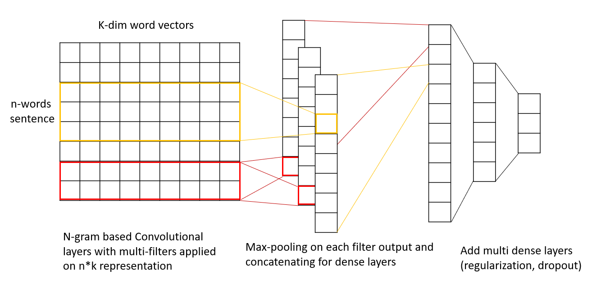

# README

This part implement a generic CNN model and a text classification targeted CNN model that is originally from paper published as [Convolutional Neural Networks for Sentence Classification](https://arxiv.org/pdf/1408.5882.pdf) from Yoon Kim et al., 2014.

------

#### Kum CNN Model Architecture

------

#### Test Result on Kum CNN

| Dataset | test-F1 | Word Vector Dim | Filters | Dense Layers | N_gram  |
| ------- | ------- | --------------- | ------- | ------------ | ------- |
| Yelp    | 0.75    | 300             | 32      | 2            | [2,3]   |
|         | 0.72    | 200             | 16      | 2            | [2,3,4] |
| Amazon  | 0.74    | 300             | 32      | 2            | [2,3]   |
|         | 0.73    | 200             | 16      | 2            | [2,3,4] |
| imdb    | 0.83    | 300             | 32      | 2            | [2,3,4] |
|         | 0.82    | 200             | 16      | 2            | [2,3,4] |
| TREC    | 0.73    | 300             | 32      | 2            | [2,3]   |
|         | 0.72    | 200             | 16      | 2            | [2,3,4] |

#### Data Description

| Dataset | Records | Tokens (avg) | words after vectorized (avg) | Class  |
| ------- | ------- | ------------ | ---------------------------- | ------ |
| Yelp    | 1000    |              | 6                            | Binary |
| Amazon  | 1000    |              | 6                            | Binary |
| imdb    | 748     |              | 11                           | Binary |
| TREC    | 5452    |              | 6                            | 6      |

